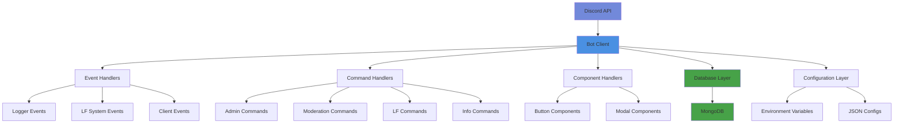

# ⚙️ Architecture Guide

The **Architecture Guide** provides a comprehensive overview of the Apatite Bot's technical structure, design patterns, and implementation details. This guide is essential for developers, contributors, and system administrators.

## 🏗️ System Architecture

### High-Level Overview


---

## 📁 Project Structure

### Core Directory Layout
```
src/
├── Commands/              # Slash Command Handlers
│   ├── Admin/            # Administrative Commands
│   ├── Dev/              # Developer Commands
│   ├── Info/             # Information Commands
│   ├── LookingForSystem/ # LFP/LFT Commands
│   └── Moderation/       # Moderation Commands
├── Components/           # Interactive Components
│   ├── Buttons/          # Button Event Handlers
│   └── Modals/           # Modal Event Handlers
├── Events/               # Event Listeners
│   ├── Client/           # Bot Client Events
│   ├── Interaction/      # Interaction Events
│   ├── Logger/           # Logging Events
│   └── Looking For System/ # LF-Specific Events
└── Structure/            # Core Architecture
    ├── Client/           # Bot Client Configuration
    ├── Configs/          # Configuration Management
    ├── Functions/        # Utility Functions
    ├── Handlers/         # Base Handler Classes
    └── Schemas/          # Database Schemas
```

---

## 🔧 Core Components

### 1. Bot Client (`src/Structure/Client/`)

#### Client.js
The main bot client class that extends Discord.js Client with additional functionality:

```javascript
class BotClient extends Client {
    constructor(options) {
        super(options);
        this.config = require('../Configs/config');
        this.logManager = new LogManager(this);
    }
    
    async start() {
        await this.registerModules();
        await this.login(this.config.Token);
    }
}
```

**Key Features:**
- **Configuration Integration**: Automatic config loading
- **Module Registration**: Dynamic command/event loading
- **Error Handling**: Comprehensive error management
- **Logging Integration**: Built-in logging system

### 2. Configuration System (`src/Structure/Configs/`)

#### config.js
Central configuration file managing all bot settings:

```javascript
module.exports = {
    // Core Bot Settings
    Token: process.env.TOKEN,
    mongoUrl: process.env.MONGO_URI,
    clientID: process.env.CLIENT_ID,
    
    // Feature Toggles
    ticketSystem: true,
    logging: true,
    lfpLftSystem: true,
    
    // System Configuration
    MaxActiveRequest: 5,
    RequestExpiryDays: 7,
    RequestArchiveDays: 30,
    
    // Rate Limiting
    rateLimits: {
        create: { maxRequests: 3, windowMs: 300000 },
        edit: { maxRequests: 5, windowMs: 60000 }
    }
};
```

#### botConfig.js
Discord.js client configuration with intents and options:

```javascript
const clientOptions = {
    intents: [
        GatewayIntentBits.Guilds,
        GatewayIntentBits.GuildMembers,
        GatewayIntentBits.GuildMessages,
        GatewayIntentBits.GuildVoiceStates,
        GatewayIntentBits.MessageContent
    ],
    partials: [Partials.Channel, Partials.User, Partials.GuildMember],
    shards: ClusterClient.getInfo().SHARD_LIST,
    shardCount: ClusterClient.getInfo().TOTAL_SHARDS
};
```

### 3. Handler System (`src/Structure/Handlers/`)

#### BaseCommand.js
Abstract base class for all slash commands:

```javascript
class BaseCommand {
    constructor(client, options) {
        this.client = client;
        this.data = options.data;
        this.options = options.options || {};
    }
    
    async execute(interaction, client) {
        throw new Error('Execute method must be implemented');
    }
}
```

#### BaseEvent.js
Abstract base class for all event listeners:

```javascript
class BaseEvent {
    constructor(client, options) {
        this.client = client;
        this.name = options.name;
        this.once = options.once || false;
    }
    
    async execute(...args) {
        throw new Error('Execute method must be implemented');
    }
}
```

#### BaseComponent.js
Abstract base class for all interactive components:

```javascript
class BaseComponent {
    constructor(client, options) {
        this.client = client;
        this.customId = options.customId;
        this.options = options.options || {};
    }
    
    async execute(interaction) {
        throw new Error('Execute method must be implemented');
    }
}
```

### 4. Database Layer (`src/Structure/Schemas/`)

#### MongoDB Integration
The bot uses Mongoose for MongoDB integration with optimized schemas:

```javascript
// Example: LF Request Schema
const lfRequestSchema = new mongoose.Schema({
    userId: { type: String, required: true },
    guildId: { type: String, required: true },
    type: { type: String, enum: ['LFP', 'LFT'], required: true },
    game: { type: String, required: true },
    content: { type: Object, required: true },
    status: { 
        type: String, 
        enum: ['pending', 'approved', 'declined', 'archived', 'expired', 'cancelled', 'deleted'],
        default: 'pending' 
    },
    createdAt: { type: Date, default: Date.now },
    updatedAt: { type: Date, default: Date.now }
});
```

---

## 🔄 Design Patterns

### 1. Modular Architecture
- **Separation of Concerns**: Each module has a single responsibility
- **Loose Coupling**: Modules interact through well-defined interfaces
- **High Cohesion**: Related functionality grouped together

### 2. Event-Driven Architecture
- **Reactive Programming**: System responds to Discord events
- **Asynchronous Processing**: Non-blocking event handling
- **Error Isolation**: Event failures don't affect other events

### 3. Configuration-Driven Design
- **Environment Variables**: Sensitive data externalized
- **JSON Configuration**: Game settings in external files
- **Feature Toggles**: Easy enable/disable of features

### 4. Handler Pattern
- **Base Classes**: Common functionality in base handlers
- **Inheritance**: Commands/events extend base classes
- **Polymorphism**: Uniform interface for all handlers

---

## 🛠️ Technical Implementation

### 1. Command Registration System

#### Dynamic Command Loading
```javascript
async registerModules() {
    // Load Commands
    const commandFiles = fs.readdirSync('./src/Commands').filter(file => file.endsWith('.js'));
    for (const file of commandFiles) {
        const command = require(`./Commands/${file}`);
        this.commands.set(command.data.name, command);
    }
    
    // Register Slash Commands
    if (this.config.deploySlashOnReady) {
        await this.deploySlashCommands();
    }
}
```

#### Slash Command Deployment
```javascript
async deploySlashCommands() {
    const commands = Array.from(this.commands.values()).map(cmd => cmd.data.toJSON());
    
    if (this.config.underDevelopment) {
        // Deploy to dev guilds only
        for (const guild of this.config.devGuilds) {
            await this.rest.put(
                Routes.applicationGuildCommands(this.config.clientID, guild.id),
                { body: commands }
            );
        }
    } else {
        // Deploy globally
        await this.rest.put(
            Routes.applicationCommands(this.config.clientID),
            { body: commands }
        );
    }
}
```

### 2. Event System

#### Event Registration
```javascript
async registerEvents() {
    const eventFiles = fs.readdirSync('./src/Events').filter(file => file.endsWith('.js'));
    
    for (const file of eventFiles) {
        const event = require(`./Events/${file}`);
        
        if (event.once) {
            this.once(event.name, (...args) => event.execute(...args, this));
        } else {
            this.on(event.name, (...args) => event.execute(...args, this));
        }
    }
}
```

### 3. Component System

#### Button Component Registration
```javascript
async registerComponents() {
    const componentFiles = fs.readdirSync('./src/Components').filter(file => file.endsWith('.js'));
    
    for (const file of componentFiles) {
        const component = require(`./Components/${file}`);
        this.components.set(component.customId, component);
    }
}
```

---

## 🔒 Security Architecture

### 1. Permission System
- **Role-Based Access**: Discord role integration
- **Command-Level Permissions**: Per-command permission checks
- **Developer Verification**: Restricted developer commands
- **Channel Permissions**: Respect Discord permission hierarchy

### 2. Input Validation
- **Sanitization**: XSS protection for user inputs
- **Rate Limiting**: Spam prevention mechanisms
- **Validation**: Comprehensive input validation
- **Error Handling**: Graceful error handling

### 3. Data Protection
- **Environment Variables**: Sensitive data externalized
- **Database Security**: MongoDB security best practices
- **Audit Logging**: Complete action audit trails
- **Privacy Compliance**: Discord ToS compliance

---

## 📊 Performance Optimization

### 1. Database Optimization
- **Strategic Indexes**: Optimized database queries
- **Connection Pooling**: Efficient database connections
- **Query Optimization**: Minimized database calls
- **Caching**: In-memory caching where appropriate

### 2. Memory Management
- **Event Cleanup**: Proper event listener cleanup
- **Rate Limit Cleanup**: Automatic rate limit data cleanup
- **Error Recovery**: Memory leak prevention
- **Resource Monitoring**: System resource monitoring

### 3. API Optimization
- **Request Batching**: Efficient Discord API usage
- **Rate Limit Handling**: Proper rate limit management
- **Error Recovery**: Automatic retry mechanisms
- **Timeout Handling**: Comprehensive timeout management

---

## 🔧 Development Workflow

### 1. Code Organization
- **Consistent Structure**: Uniform file organization
- **Naming Conventions**: Clear naming patterns
- **Documentation**: Comprehensive code documentation
- **Type Safety**: TypeScript integration where beneficial

### 2. Error Handling
- **Centralized Error Handling**: Unified error management
- **User-Friendly Messages**: Clear error messages for users
- **Developer Logging**: Detailed error logs for developers
- **Graceful Degradation**: System continues working despite errors

### 3. Testing Strategy
- **Manual Testing**: Comprehensive manual testing procedures
- **Integration Testing**: System integration validation
- **Error Testing**: Edge case and error condition testing
- **Performance Testing**: System performance validation

---

## 🚀 Deployment Architecture

### 1. Environment Configuration
- **Development**: Local development with dev guilds
- **Staging**: Testing environment with production-like setup
- **Production**: Live environment with full features

### 2. Scaling Considerations
- **Sharding Support**: Discord.js hybrid sharding
- **Database Scaling**: MongoDB scaling strategies
- **Load Balancing**: Multiple bot instance support
- **Monitoring**: System health monitoring

### 3. Maintenance
- **Hot Reloading**: Developer command for module reloading
- **Configuration Updates**: Runtime configuration changes
- **Database Migrations**: Schema update procedures
- **Backup Strategies**: Data backup and recovery

---

## 📋 Best Practices

### 1. Code Quality
- **ESLint Configuration**: Consistent code formatting
- **Error Handling**: Comprehensive error management
- **Documentation**: Clear code documentation
- **Version Control**: Proper Git workflow

### 2. Security
- **Input Validation**: All user inputs validated
- **Permission Checks**: Comprehensive permission validation
- **Audit Logging**: Complete action audit trails
- **Data Protection**: Sensitive data protection

### 3. Performance
- **Database Optimization**: Efficient database usage
- **Memory Management**: Proper resource cleanup
- **API Efficiency**: Optimized Discord API usage
- **Monitoring**: System performance monitoring

---

## 🔍 Troubleshooting Guide

### Common Issues

#### Module Loading Errors
- **Issue**: Commands/events not loading
- **Solution**: Check file structure and exports
- **Check**: Verify file naming and syntax

#### Database Connection Issues
- **Issue**: MongoDB connection failures
- **Solution**: Check connection string and permissions
- **Check**: Verify MongoDB service status

#### Permission Errors
- **Issue**: Bot lacks required permissions
- **Solution**: Check Discord bot permissions
- **Check**: Verify role hierarchy and channel permissions

---

> [!NOTE]
> This architecture guide provides a comprehensive overview of the bot's technical structure. For specific implementation details, refer to the individual system documentation files.
