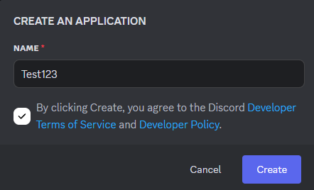
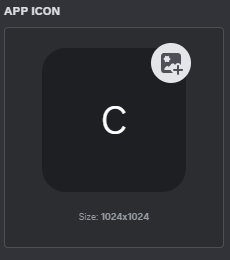
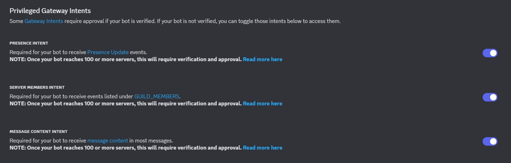
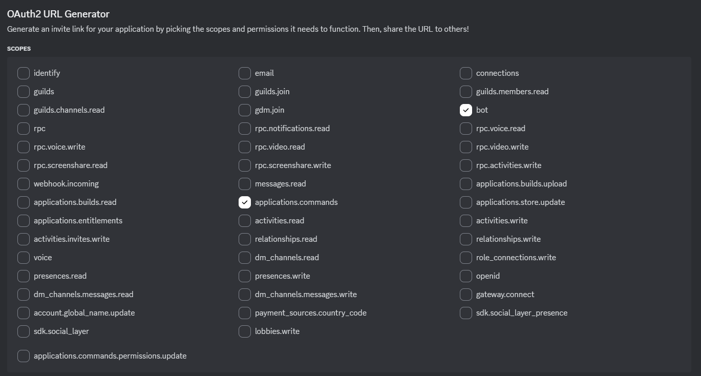
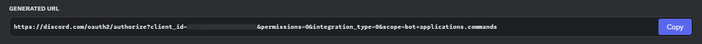

# 🛠️ Discord Bot Setup Guide

> A complete step-by-step guide to creating, configuring, and inviting your own Discord bot using the [Discord Developer Portal](https://discord.com/developers/applications).

---

## 📌 Table of Contents
- [1. Creating Your Bot Application](#1-creating-your-bot-application)
  - [Setting a Bot Icon](#setting-a-bot-icon)
- [2. Setting Intents](#2-setting-intents)
- [3. Setting Up OAuth2](#3-setting-up-oauth2)
- [4. Generating an Invite Link](#4-generating-an-invite-link)
- [5. Additional Tips](#5-additional-tips)
- [6. Useful Links](#6-useful-links)

---

## 1. Creating Your Bot Application
1. Navigate to the [Discord Developer Portal](https://discord.com/developers/applications).
2. Click **New Application**.
3. Enter a **name** for your bot and click **Create**.
4. Go to the **Bot** tab and click **Add Bot**.
5. Confirm by clicking **Yes, do it!**.




### 🎨 Setting a Bot Icon
- In the **Bot** tab, under **Profile Picture**, click the placeholder icon to upload your bot’s image/logo.




---

## 2. Setting Intents
Discord requires enabling **Privileged Gateway Intents** for specific bot functions.

1. In the **Bot** tab, scroll to **Privileged Gateway Intents**.
2. Enable the required intents:
   - ✅ **PRESENCE INTENT** → Detect user presence (online, idle, dnd, offline).
   - ✅ **SERVER MEMBERS INTENT** → Access member join/leave/update events.
   - ✅ **MESSAGE CONTENT INTENT** → Allow the bot to read message content (server messages only).
3. Click **Save Changes**.




> [!TIP]
> Only enable the intents your bot **actually needs** to reduce unnecessary API usage.

---

## 3. Setting Up OAuth2
To invite your bot to servers, configure OAuth2:

1. Go to the **OAuth2 → URL Generator** tab.
2. Under **Scopes**, select:
   - `bot`
   - `applications.commands` *(for slash commands support)*
3. Under **Bot Permissions**, select the permissions your bot requires:
   - `SEND_MESSAGES`
   - `READ_MESSAGE_HISTORY`
   - `MANAGE_ROLES`
   - *(Add others based on your bot’s functionality)*
4. Copy the generated URL.




---

## 4. Generating an Invite Link
1. Paste the copied OAuth2 URL into your browser.
2. Select the **server** where you want to add the bot.
3. Click **Authorize** and complete the captcha.




---

## 5. Additional Tips

> [!IMPORTANT]
> ⚠️ Your **bot token is your password**. Keep it private!

- 🔑 **Save Your Token:** Copy and store your bot token securely.
- 🔒 **Keep It Safe:** Never share it publicly or commit it to GitHub.
- 🌱 **Use Environment Variables:** Store tokens in `.env` files instead of hardcoding.

Example `.env` file:
```env
DISCORD_TOKEN=your_bot_token_here
```
Example Node.js usage:
```js
require('dotenv').config();
const { Client } = require('discord.js');

const client = new Client({ intents: [] });
client.login(process.env.DISCORD_TOKEN);
```
---

## 6. Useful Links
- [Discord.js Documentation](https://discord.js.org/#/)
- [Discord Developer Portal](https://discord.com/developers/applications)
- [OAuth2 Documentation](https://discord.com/developers/docs/topics/oauth2)
---
✨ Now you’re ready to bring your bot to life. Happy coding! 😄

