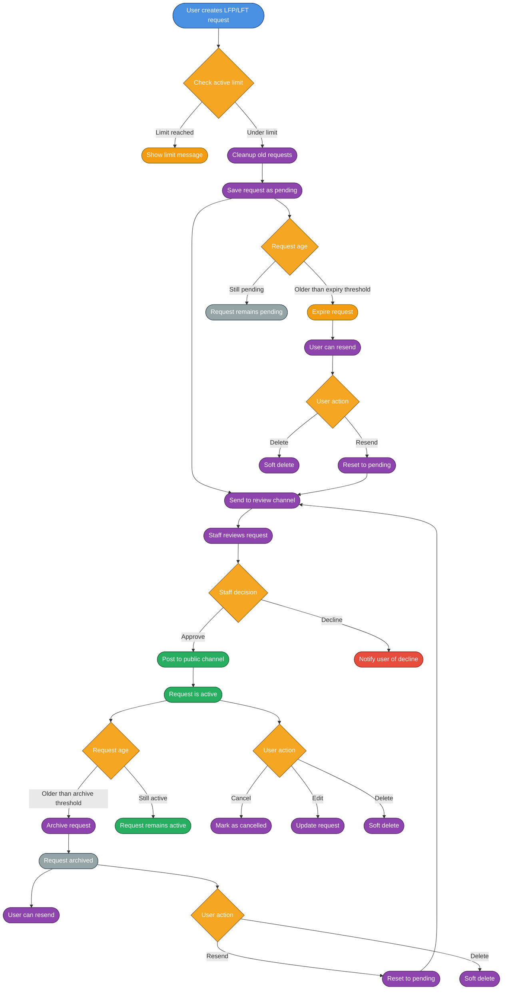
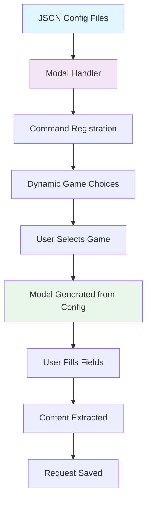
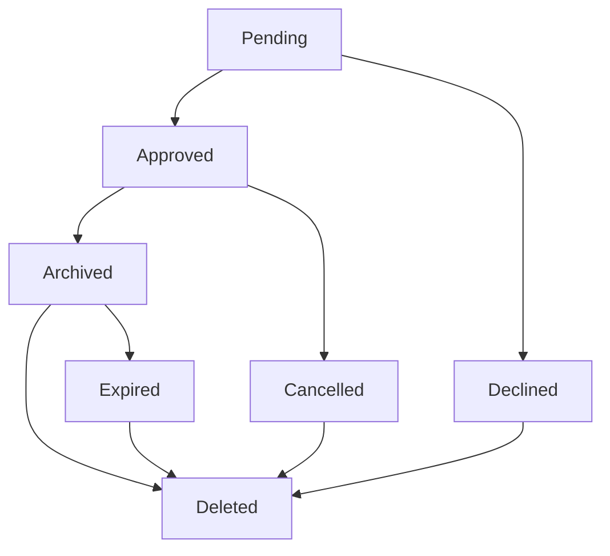

# 🔎 LFP / LFT System

The **Looking For Players (LFP) / Looking For Team (LFT)** system is designed to help gamers connect with teammates and groups efficiently. Users can submit structured requests, which are reviewed by staff before being shared in public channels.

Other players can then view **approved requests** and directly contact the original poster.

## ✨ Features

- **Multi-game Support**: Valorant, Counter-Strike 2, League of Legends (Easily extensible via JSON)
- **JSON Configuration**: Games and fields defined in config files, no code changes needed
- **Game-Specific Channels**: Separate review and public channels for each game
- **Request Management**: Create, edit, delete, cancel, and resend requests
- **Status Tracking**: Pending, approved, declined, archived, expired, cancelled, deleted
- **Auto-cleanup**: Automatic expiration and archiving of old requests
- **Staff Review**: Moderation system with approval/decline workflow
- **Comprehensive Notifications**: Detailed DM notifications for all actions
- **Action Logging**: Complete audit trail with beautiful formatting
- **Smart Edit Logic**: Editing approved requests resets them for review
- **Permission System**: Role-based access control and ownership validation
- **Dynamic Modals**: Modal fields generated automatically from JSON configuration

---

## 🌊 Workflow Overview

### Complete Request Lifecycle


---

## ⚙️ JSON Configuration System

The LFP/LFT system uses JSON configuration files to define games and their modal fields. This makes adding new games extremely easy - just edit the JSON files!

### Configuration Files

#### `src/Structure/Configs/LFConfig/lfp.json`
Defines LFP (Looking For Players) games and their fields.

#### `src/Structure/Configs/LFConfig/lft.json`
Defines LFT (Looking For Team) games and their fields.

### JSON Structure

```json
{
  "gameKey": {
    "reviewChannel": "ENV_VAR_NAME",
    "publicChannel": "ENV_VAR_NAME", 
    "displayName": "Game Display Name",
    "fields": [
      {
        "id": "fieldId",
        "label": "Field Label",
        "style": "SHORT|PARAGRAPH",
        "required": true|false,
        "placeholder": "Placeholder text",
        "maxLength": 100
      }
    ]
  }
}
```

### Field Properties

- **`id`**: Unique identifier for the field (used in database)
- **`label`**: Display name shown to users
- **`style`**: `SHORT` for single line, `PARAGRAPH` for multi-line
- **`required`**: Whether the field is mandatory
- **`placeholder`**: Hint text shown in the input field
- **`maxLength`**: Maximum character limit (optional)

### Adding a New Game

1. **Add to JSON files**: Edit both `lfp.json` and `lft.json`
2. **Define fields**: Specify the fields specific to that game
3. **Set channels**: Reference environment variables for channels
4. **Restart bot**: The changes take effect immediately

### Example: Adding Rocket League

**lfp.json:**
```json
{
  "rocketleague": {
    "reviewChannel": "RL_LF_REVIEW_CHANNEL_ID",
    "publicChannel": "RL_LFP_LFT_CHANNEL_ID",
    "displayName": "Rocket League",
    "fields": [
      {
        "id": "teamName",
        "label": "Team Name",
        "style": "SHORT",
        "required": true,
        "placeholder": "e.g., Apatite",
        "maxLength": 100
      },
      {
        "id": "ranksNeeded",
        "label": "Ranks Needed",
        "style": "SHORT",
        "required": true,
        "placeholder": "e.g., Diamond, Champion",
        "maxLength": 100
      },
      {
        "id": "playstyle",
        "label": "Playstyle",
        "style": "PARAGRAPH",
        "required": false,
        "placeholder": "Aggressive, defensive, etc...",
        "maxLength": 500
      }
    ]
  }
}
```

**lft.json:**
```json
{
  "rocketleague": {
    "reviewChannel": "RL_LF_REVIEW_CHANNEL_ID",
    "publicChannel": "RL_LFP_LFT_CHANNEL_ID",
    "displayName": "Rocket League",
    "fields": [
      {
        "id": "epicID",
        "label": "Epic ID",
        "style": "SHORT",
        "required": true,
        "placeholder": "e.g., Apatite",
        "maxLength": 100
      },
      {
        "id": "currentRank",
        "label": "Current Rank",
        "style": "SHORT",
        "required": true,
        "placeholder": "e.g., Diamond 2",
        "maxLength": 100
      },
      {
        "id": "preferredRole",
        "label": "Preferred Role",
        "style": "SHORT",
        "required": true,
        "placeholder": "Striker, Midfielder, Defender",
        "maxLength": 100
      }
    ]
  }
}
```

### Configuration Flow



---


## 📁 Project Structure

The LFP/LFT system is organized into dedicated folders for better maintainability:

### Core Functions (`src/Structure/Functions/LFSystem/`)
- **`modalHandler.js`** - Centralized modal management and JSON config loader
- **`lfHelpers.js`** - Common helper functions and utilities
- **`lfActionLogger.js`** - Action logging and game channel management
- **`activeRequest.js`** - Active request checking and validation
- **`requestCleanup.js`** - Automatic cleanup and archiving system

### Configuration (`src/Structure/Configs/LFConfig/`)
- **`lfp.json`** - LFP game definitions and field configurations
- **`lft.json`** - LFT game definitions and field configurations

### Commands (`src/Commands/LookingForSystem/`)
- **`lfp.js`** - Looking For Players command handler
- **`lft.js`** - Looking For Team command handler
- **`request.js`** - Request management command handler

### Components (`src/Components/`)
- **`Modals/`** - Modal components for create/edit operations
- **`Buttons/`** - Button components for review actions

## 🔧 Technical Features

### Modal Handler System
- **Dynamic Generation**: Modals created automatically from JSON configuration
- **Field Extraction**: Content extracted using field IDs from config
- **Embed Generation**: Review and DM embeds generated from field definitions
- **Validation**: Field validation based on JSON requirements
- **Extensibility**: New games require only JSON changes, no code modifications

### Game-Specific Channel System
- **Separate Channels**: Each game has its own review and public channels
- **Automatic Routing**: Requests are sent to the correct channels based on game
- **Fallback Support**: Legacy channel support for backward compatibility
- **Environment Variables**: Easy configuration through `.env` file

### Auto-Cleanup System
- **Expiry**: Pending requests older than `RequestExpiryDays` are marked as expired
- **Archiving**: Approved requests older than `RequestArchiveDays` are archived
- **Global Cleanup**: Can be run on interval to clean all guilds
- **Message Cleanup**: Automatically removes public channel messages when archiving
- **Game-Aware**: Cleanup respects game-specific channels

### Permission System
- **Ownership**: Users can only manage their own requests
- **Status-based Actions**: Different actions allowed based on request status
- **Staff Review**: Only users with LF mod role can approve/decline requests
- **Action Validation**: All actions are validated before execution

### Data Integrity
- **Soft Deletes**: Requests are marked as deleted, not removed from database
- **Audit Trail**: All status changes are tracked with timestamps
- **Validation**: Request IDs and permissions are validated before operations
- **Status Transitions**: Enforced valid status transitions

### Notification System
- **Comprehensive DMs**: Users receive detailed notifications for all actions
- **Game Information**: All notifications include game and request details
- **Action Context**: Clear explanation of what happened and next steps
- **Channel References**: Direct links to relevant channels

### Logging System
- **Action Logging**: All LF actions are logged with full context
- **Beautiful Formatting**: Uses `>>>` formatting consistent with other logs
- **Detailed Information**: Includes request details, user info, and staff actions
- **Color Coding**: Different colors for different action types

---

## 🤖 Commands

### LFP Commands
- `/lfp create <game>` - Create a new LFP request
  - **Games**: Valorant, Counter-Strike 2, League of Legends (More games added via json)
  - **Fields**: Team Name, Roles Needed, Peak Rank, Current Rank, Additional Info (Depending on the json fields)
- `/lfp edit <request_id>` - Edit an existing LFP request

### LFT Commands  
- `/lft create <game>` - Create a new LFT request
  - **Games**: Valorant, Counter-Strike 2, League of Legends (Relies on Json data)
  - **Fields**: Game ID, Roles Played, Peak/Current Rank, Recent Teams, Additional Info (Relies on Json data)
- `/lft edit <request_id>` - Edit an existing LFT request

### Request Management Commands
- `/requests list` - List all your LFP/LFT requests (paginated)
- `/requests cancel <request_id>` - Cancel a pending/approved request
- `/requests resend <request_id>` - Resend an archived/expired request
- `/requests delete <request_id>` - Delete a declined/archived/expired/cancelled request

---

## 📅 Database Structure
```yaml
    userId:          String (required)
    guildId:         String (required)
    type:            Enum("LFP", "LFT") (required)
    game:            String (required)
    content:         Object (form details, required)
    status:          Enum("pending", "approved", "declined", "archived", "expired", "cancelled", "deleted") (default: "pending")
    reviewedBy:      String (nullable, staff ID)
    messageId:       String (nullable, staff review message ID)
    publicMessageId: String (nullable, public channel post ID)
    createdAt:       Date (default: now)
    updatedAt:       Date (default: now, auto-updated)
    expiresAt:       Date (nullable, when request expires)
    archivedAt:      Date (nullable, when request was archived)
    deletedAt:       Date (nullable, when request was soft deleted)
```

## 🔄 Request Lifecycle

### Status Flow


### Status Descriptions
- **pending**: Request submitted, awaiting staff review
- **approved**: Request approved and posted to public channel
- **declined**: Request rejected by staff
- **archived**: Approved request older than archive threshold
- **expired**: Pending request older than expiry threshold
- **cancelled**: User cancelled their own request
- **deleted**: Request soft deleted (can only be done for inactive statuses)

---

## ⚒️ Moderation & Review
- 🛡 **Game-Specific Review**: Separate review channels for each game
- ✅ **Smart Approval**: Requests posted to correct public channels
- ❌ **Detailed Decline**: Users notified with comprehensive information
- 📦 **Auto-Archiving**: Old requests automatically archived with cleanup
- 📑 **Complete Logging**: All actions logged with beautiful formatting
- 🔒 **Role-Based Permissions**: Staff reviewers with proper access control
- ⏳ **Rate Limiting**: Built-in spam prevention with active request limits
- 🔢 **Request Limits**: Users limited to configurable number of active requests
- 🔄 **Smart Editing**: Editing approved requests resets them for review
- 📱 **DM Notifications**: Comprehensive notifications for all user actions

## 🔧 Configuration

### Environment Variables
Add these to your `.env` file:

```env
# Valorant Channels (Legacy - still supported)
VALO_LF_REVIEW_CHANNEL_ID=your_valorant_review_channel_id
VALO_LFP_LFT_CHANNEL_ID=your_valorant_public_channel_id

# Counter-Strike 2 Channels
CS2_LF_REVIEW_CHANNEL_ID=your_cs2_review_channel_id
CS2_LFP_LFT_CHANNEL_ID=your_cs2_public_channel_id

# League of Legends Channels
LOL_LF_REVIEW_CHANNEL_ID=your_lol_review_channel_id
LOL_LFP_LFT_CHANNEL_ID=your_lol_public_channel_id

# Action Logging
LF_ACTION_LOG_CHANNEL_ID=your_action_log_channel_id

# LF System Settings
LF_MOD_ROLE_ID=your_lf_mod_role_id
```

### Channel Setup
1. **Review Channels**: Create separate channels for each game's review process
2. **Public Channels**: Create channels where approved requests are posted
3. **Log Channel**: Create a channel for action logging and accountability
4. **Permissions**: Ensure LF mod role has access to review channels

> [!NOTE]
> Ensure to configure the necessary environment variables and database connections as per the main documentation to enable this system.

---

## 📸 Showcase

### Request submission modal (Valorant LFT example)


### Submission confirmation


### Staff review channel


### Public channel (approved requests)


### User notification: approved


### User notification: declined


### Active requests list command


