# 🔎 LFP / LFT System

> [!IMPORTANT]
> This feature is currently under active development.
> Expect changes to command syntax and database structure in future updates.

The **Looking For Players (LFP) / Looking For Team (LFT)** system is designed to help gamers connect with teammates and groups efficiently. Users can submit structured requests, which are reviewed by staff before being shared in public channels.

Other players can then view **approved requests** and directly contact the original poster.

---

## 🌊 Workflow Overview

### Request Submission & Review


### Request Management (User Controls)


### Failsafe Cleanup (User Leaves)


### Failsafe Cleanup (On-Demand Cleanup)

```mermaid
flowchart TD
    A([User sends a request via modal]):::process --> B{Check old request from the same user}:::decision

    B -- Pending --> C{Older than RequestExpiryDays?}:::decision
    C -- Yes --> D([Set status → Expired]):::expired
    C -- No --> E([Keep as Pending]):::pending

    B -- Approved --> F{Older than RequestArchiveDays?}:::decision
    F -- Yes --> G([Set status → Archived]):::archived
    F -- No --> H([Keep as Approved]):::approved

    %% Styles
    classDef process fill:#8E44AD,stroke:#4A235A,color:#fff;
    classDef decision fill:#F5A623,stroke:#7A4A00,color:#fff;
    classDef expired fill:#E74C3C,stroke:#7B241C,color:#fff;
    classDef archived fill:#34495E,stroke:#1C2833,color:#fff;
    classDef pending fill:#3498DB,stroke:#1B4F72,color:#fff;
    classDef approved fill:#27AE60,stroke:#14532D,color:#fff;
```


---

## 🤖 Commands
- Game specific lfp/lft create commands
    - `valo-looking-for players`
    - `valo-looking-for team`
    - `csgo-looking-for players`
    - `csgo-looking-for team` .... etc (Create commands for other games as per requirement)

- Request management commands
    - `requests list` - List all active LFP/LFT requests
    - `requests cancel <request_id>` - Cancel an active LFP/LFT request
    - `requests resend <request_id>` - Resend an active LFP/LFT request

---

## 📅 Database Structure
```yaml
    userId:          String (required)
    guildId:         String (required)
    type:            Enum("LFP", "LFT") (required)
    game:            String (required)
    content:         Object (form details, required)
    status:          Enum("pending", "approved", "declined", "archived", "expired") (default: "pending")
    reviewedBy:      String (nullable, staff ID)
    messageId:       String (nullable, staff review message ID)
    publicMessageId: String (nullable, public channel post ID)
    createdAt:       Date (default: now)
```

---

## ⚒️ Moderation & Review
- 🛡 Staff review channel for pending requests
- ✅ Approve → Request posted to public channel
- ❌ Decline → User notified automatically
- 📦 Old requests can be archived/expired
- 📑 Actions are logged for accountability
- 🔒 Role-based permissions for staff reviewers
- ⏳ Built-in rate limiting to prevent spam
- 🔢 Users may only hold a limited number of active requests

> [!NOTE]
> Ensure to configure the necessary environment variables and database connections as per the main documentation to enable this system.

---

## 📸 Showcase

### Request submission modal (Valorant LFT example)


### Submission confirmation


### Staff review channel


### Public channel (approved requests)


### User notification: approved


### User notification: declined


### Active requests list command


