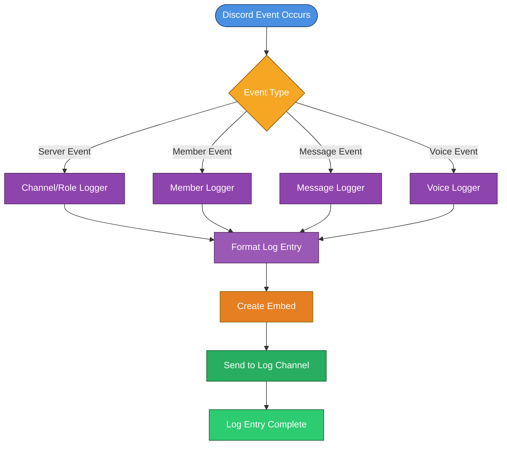

# 📜 Logging System

The **Logging System** provides comprehensive event tracking and audit capabilities for Discord servers. It monitors all significant server events, member activities, message changes, and voice state modifications with professional formatting and detailed information.

## ✨ Features

### Core Functionality
- **Server Events**: Channel create/delete/update, role create/delete/update
- **Member Events**: Join/leave, role changes, nickname updates
- **Message Events**: Create, edit, delete, bulk delete with content preservation
- **Voice Events**: Voice state changes and channel activity
- **Audit Trail**: Integration with Discord audit logs for executor tracking
- **Beautiful Formatting**: Professional embed formatting with timestamps

### Event Categories
- **Server Management**: Channel and role modifications
- **Member Activity**: User join/leave and profile changes
- **Message Activity**: Message lifecycle tracking
- **Voice Activity**: Voice channel state changes
- **Moderation Actions**: Staff actions and administrative changes

---

## 🌊 Workflow Overview

### Complete Logging Flow


---

## 📁 Project Structure

### Event Loggers (`src/Events/Logger/`)

#### Server Events
- **`ChannelCreatelogs.js`** - Logs channel creation events
- **`ChannelDeletelogs.js`** - Logs channel deletion events
- **`ChannelUpdatelogs.js`** - Logs channel modification events
- **`RoleCreatelogs.js`** - Logs role creation events
- **`RoleDeletelogs.js`** - Logs role deletion events
- **`RoleUpdatelogs.js`** - Logs role modification events
- **`serverlogs.js`** - General server event logging

#### Member Events
- **`MemberJoinLogs.js`** - Logs member join events
- **`MemberLeaveLogs.js`** - Logs member leave events
- **`MemberRoleLogs.js`** - Logs member role changes
- **`MemberNameUpdatelogs.js`** - Logs nickname changes

#### Message Events
- **`MessageDeletelogs.js`** - Logs message deletion events
- **`MessageEditlogs.js`** - Logs message edit events
- **`MessageBulkDeletelogs.js`** - Logs bulk message deletion

#### Voice Events
- **`voicelogs.js`** - Logs voice state changes

### Core Functions (`src/Structure/Functions/`)
- **`Logger.js`** - Base logging utility class
- **`LogManager.js`** - Centralized log management system

---

## 🔧 Configuration

### Environment Variables
Add these to your `.env` file:

```env
# Logging System Configuration
LOG_WEBHOOK=your_logging_webhook_url
SERVER_LOG_CHANNEL_ID=your_server_log_channel_id
MEMBER_LOG_CHANNEL_ID=your_member_log_channel_id
VOICE_LOG_CHANNEL_ID=your_voice_log_channel_id
MESSAGE_LOG_CHANNEL_ID=your_message_log_channel_id
WARN_LOG_CHANNEL_ID=your_warning_log_channel_id
```

### Bot Configuration (`config.js`)
```javascript
// Logging System Settings
logging: true,
serverLogChannelId: process.env.SERVER_LOG_CHANNEL_ID,
memberLogChannelId: process.env.MEMBER_LOG_CHANNEL_ID,
voiceLogChannelId: process.env.VOICE_LOG_CHANNEL_ID,
messageLogChannelId: process.env.MESSAGE_LOG_CHANNEL_ID,
logWebhook: process.env.LOG_WEBHOOK,
```

---

## 📊 Event Types & Logging

### Server Events

#### Channel Events
- **Channel Creation**: New channel created with details
- **Channel Deletion**: Channel removed with context
- **Channel Updates**: Name, topic, permissions changes

#### Role Events
- **Role Creation**: New role created with permissions
- **Role Deletion**: Role removed with impact analysis
- **Role Updates**: Permission and property changes

### Member Events

#### Join/Leave Events
- **Member Join**: New member welcome with account age
- **Member Leave**: Departure logging with server duration
- **Member Update**: Profile changes and role modifications

#### Profile Changes
- **Nickname Changes**: Username and nickname updates
- **Role Changes**: Role additions and removals
- **Avatar Changes**: Profile picture updates

### Message Events

#### Message Lifecycle
- **Message Creation**: New message logging (if enabled)
- **Message Editing**: Content changes with before/after
- **Message Deletion**: Deleted content preservation
- **Bulk Deletion**: Mass message removal logging

#### Content Preservation
- **Text Content**: Full message content saved
- **Attachments**: File information preserved
- **Embeds**: Rich embed content maintained
- **Timestamps**: Accurate timing information

### Voice Events

#### Voice State Changes
- **Channel Joins**: Voice channel connections
- **Channel Leaves**: Voice channel disconnections
- **Channel Switches**: Moving between voice channels
- **Mute/Deafen**: Audio state changes

---

## 🛡️ Security & Privacy

### Content Handling
- **Sensitive Data**: Automatic filtering of sensitive information
- **Privacy Protection**: User data handled according to Discord ToS
- **Content Sanitization**: Safe handling of user-generated content
- **Access Control**: Log access restricted to authorized staff

### Audit Trail
- **Executor Tracking**: Identifies who performed actions
- **Action Context**: Provides context for administrative decisions
- **Timestamp Accuracy**: Precise timing for all events
- **Compliance**: Maintains records for server administration

---

## 📸 Showcase

### Professional Embed Formatting
All log entries use professional Discord embeds with:
- **Color Coding**: Different colors for different event types
- **Rich Information**: Detailed event information
- **User Avatars**: Profile pictures for visual identification
- **Timestamps**: Precise timing information
- **Action Context**: Clear explanation of what happened

### Example Log Entries

#### Member Join
```
🟢 Member Joined
>>> Member: Username#1234 (123456789)
Account Age: 2 years, 3 months
Server Member Count: 1,234
```

#### Message Deletion
```
🔴 Message Deleted
>>> Author: Username#1234 (123456789)
Channel: #general (123456789)
Message ID: 123456789
Content: [Message content preserved]
```

#### Channel Creation
```
🟢 Channel Created
>>> Channel: #new-channel (123456789)
Type: Text Channel
Created by: Username#1234 (123456789)
```

---

## 🔧 Technical Features

### Log Manager System
- **Centralized Management**: Single point for all logging operations
- **Channel Routing**: Automatic routing to appropriate log channels
- **Format Consistency**: Uniform formatting across all log types
- **Error Handling**: Robust error handling for logging failures

### Audit Log Integration
- **Executor Identification**: Identifies who performed actions
- **Action Context**: Provides context for administrative decisions
- **Permission Tracking**: Monitors permission changes
- **Compliance**: Maintains audit trail for server administration

### Performance Optimization
- **Efficient Processing**: Optimized event handling
- **Rate Limiting**: Protection against log spam
- **Batch Processing**: Efficient handling of bulk events
- **Memory Management**: Proper cleanup of log data

---

## 🚀 Getting Started

### 1. Create Log Channels
Set up dedicated channels for different log types:
- **Server Logs**: Channel and role events
- **Member Logs**: User join/leave and profile changes
- **Message Logs**: Message lifecycle events
- **Voice Logs**: Voice channel activity
- **Warning Logs**: Administrative warnings and actions

### 2. Configure Permissions
Ensure the bot has necessary permissions:
- `ViewChannel` - Access to log channels
- `SendMessages` - Send log entries
- `EmbedLinks` - Create rich embeds
- `ReadMessageHistory` - Access message history
- `ViewAuditLog` - Access audit logs

### 3. Set Environment Variables
Configure logging channels in your `.env` file.

### 4. Enable Logging
Set `logging: true` in your bot configuration.

---

## 🔄 Integration with Other Systems

### Moderation Integration
- **Action Logging**: All moderation actions logged
- **Staff Accountability**: Track staff actions
- **Compliance**: Maintain records for server administration
- **Audit Trail**: Complete audit trail for moderation decisions

### Ticket System Integration
- **Ticket Actions**: All ticket operations logged
- **Staff Activity**: Track staff ticket management
- **User Activity**: Monitor user ticket creation
- **Resolution Tracking**: Track ticket resolution times

### LFP/LFT System Integration
- **Request Actions**: All LF system actions logged
- **Staff Reviews**: Track staff review activities
- **User Activity**: Monitor user request patterns
- **System Health**: Track system performance

---

## 📊 Analytics & Monitoring

### Log Analytics
- **Event Frequency**: Track most common events
- **User Activity**: Monitor user behavior patterns
- **Staff Activity**: Track staff moderation activity
- **System Health**: Monitor logging system performance

### Performance Metrics
- **Log Processing Time**: Track event processing speed
- **Channel Performance**: Monitor log channel activity
- **Error Rates**: Track logging failure rates
- **Storage Usage**: Monitor log data storage

---

## 🔧 Advanced Configuration

### Custom Log Formats
You can customize log formatting by modifying the LogManager:

```javascript
// Example: Custom log format
const customLogEmbed = new EmbedBuilder()
    .setColor(0x00ff00)
    .setTitle('Custom Event')
    .setDescription('>>> **Details**: Custom event occurred')
    .setTimestamp()
    .setFooter({ text: 'Custom Logger' });
```

### Webhook Integration
Configure webhook logging for external systems:

```javascript
// Example: Webhook logging
const webhook = new WebhookClient({ url: process.env.LOG_WEBHOOK });
await webhook.send({ embeds: [logEmbed] });
```

---

## 🚨 Troubleshooting

### Common Issues

#### Missing Logs
- **Issue**: Events not being logged
- **Solution**: Check bot permissions and channel access
- **Check**: Verify logging is enabled in configuration

#### Permission Errors
- **Issue**: Bot can't send logs
- **Solution**: Ensure bot has SendMessages permission
- **Check**: Verify channel permissions

#### Performance Issues
- **Issue**: Logging causing lag
- **Solution**: Check for excessive event frequency
- **Check**: Monitor bot resource usage

---

## 📋 Log Types Reference

### Event Colors
- **🟢 Green (0x43B581)**: Positive events (joins, creations)
- **🔴 Red (0xed4245)**: Negative events (leaves, deletions)
- **🟡 Yellow (0xF5A623)**: Neutral events (updates, changes)
- **🔵 Blue (0x4A90E2)**: Information events (status changes)

### Log Channels
- **Server Logs**: Channel and role events
- **Member Logs**: User activity and profile changes
- **Message Logs**: Message lifecycle events
- **Voice Logs**: Voice channel activity
- **Warning Logs**: Administrative actions and warnings

---

> [!NOTE]
> The logging system is production-ready with comprehensive event coverage, professional formatting, and robust error handling. It provides complete audit trails for server administration and compliance.
