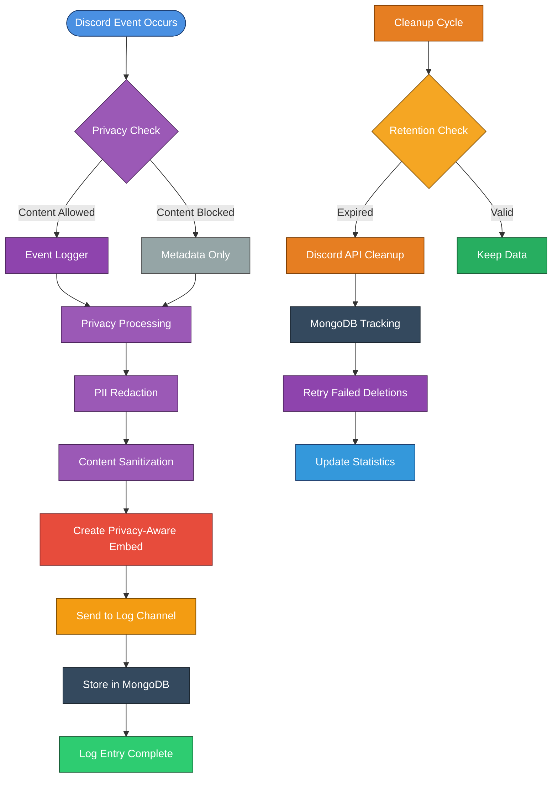

# 📜 Logging System

The logging system tracks Discord server events and provides audit trails for moderation and compliance. It handles everything from message changes to member activities with privacy controls built-in.

> [!IMPORTANT]
> **Privacy & Compliance**: This logging system is designed with privacy-first principles. All data collection, processing, and retention follows strict privacy controls and compliance requirements. Review the [Data Retention Policy](../README.md#data-retention-policy) before configuration.

> [!INFO]
> **Recent Updates**: The logging system has been enhanced with better error handling, and improved config compatibility. DataCleanupManager now only logs initialization and completion with comprehensive stats.

## ✨ Features

### 🎯 **Event Coverage**
- **Server Events**: Channel, role, and server updates
- **Member Events**: Join/leave, role changes, nickname updates, bans
- **Message Events**: Create, edit, delete, bulk delete with privacy controls
- **Voice Events**: Voice state changes and channel activity
- **Thread Events**: Thread create/delete/update with parent channel tracking
- **Invite Events**: Invite create/delete with usage statistics
- **Webhook Events**: Webhook updates with channel tracking
- **Emoji Events**: Server emoji add/remove/update with asset tracking
- **Sticker Events**: Server sticker add/remove/update with asset tracking
- **Audit Trail**: Complete executor tracking with Discord audit log integration

### 🔒 **Privacy Controls**
- **GDPR/CCPA Compliant**: Automatic PII redaction and content sanitization
- **Privacy Defaults**: Full message content logging disabled by default
- **User Rights**: Data deletion, portability, and access request support
- **Anonymization**: User data anonymization for analytics and reporting
- **Retention Policies**: Configurable data retention with automatic cleanup

### 🗄️ **Data Management**
- **MongoDB Integration**: Complete audit trails and cleanup statistics storage
- **Discord API Cleanup**: Direct message deletion from log channels
- **Retry Mechanisms**: Failed deletion tracking and automatic retry
- **Performance Analytics**: Real-time metrics and cleanup statistics
- **Compliance Reporting**: Detailed audit trails for regulatory requirements

### 🎨 **Professional Formatting**
- **Beautiful Embeds**: Professional formatting with timestamps and user avatars
- **Smart Content**: Privacy-aware content display with sanitization
- **Executor Tracking**: Staff action identification and audit log integration
- **Error Handling**: Comprehensive error management and recovery
- **Silent Operation**: Minimal logging output with essential notifications

---

## 🌊 Workflow Overview

### Privacy-Compliant Logging Flow with Hybrid Cleanup


---

## 🎯 Complete Event Coverage

### **High Priority Events (Core Functionality)**

| Event | File | Description | Privacy Level |
|-------|------|-------------|---------------|
| **MessageDelete** | `MessageDeletelogs.js` | Message deletion with content preservation | Content-based |
| **MessageUpdate** | `MessageEditlogs.js` | Message edits with before/after comparison | Content-based |
| **MessageBulkDelete** | `MessageBulkDeletelogs.js` | Bulk message deletion events | Metadata-only |
| **GuildMemberRemove** | `MemberLeaveLogs.js` | Member leave events with join duration | Metadata-only |
| **GuildMemberAdd** | `MemberJoinLogs.js` | Member join events with account age | Metadata-only |
| **GuildUpdate** | `serverlogs.js` | Server setting changes | Metadata-only |
| **VoiceStateUpdate** | `voicelogs.js` | Voice channel activity | Metadata-only |
| **ChannelCreate** | `ChannelCreatelogs.js` | Channel creation events | Metadata-only |
| **ChannelDelete** | `ChannelDeletelogs.js` | Channel deletion events | Metadata-only |
| **ChannelUpdate** | `ChannelUpdatelogs.js` | Channel modification events | Metadata-only |
| **GuildRoleCreate** | `RoleCreatelogs.js` | Role creation events | Metadata-only |
| **GuildRoleDelete** | `RoleDeletelogs.js` | Role deletion events | Metadata-only |
| **GuildRoleUpdate** | `RoleUpdatelogs.js` | Role modification events | Metadata-only |
| **GuildMemberUpdate** | `MemberNameUpdatelogs.js` | Nickname changes | Metadata-only |
| **GuildBanAdd** | `GuildBanAddLogs.js` | Member ban events | Metadata-only |
| **GuildBanRemove** | `GuildBanRemoveLogs.js` | Member unban events | Metadata-only |
| **InviteCreate** | `InviteCreateLogs.js` | Invite link creation | Metadata-only |
| **InviteDelete** | `InviteDeleteLogs.js` | Invite link deletion | Metadata-only |
| **ThreadCreate** | `ThreadCreateLogs.js` | Thread creation events | Metadata-only |
| **ThreadDelete** | `ThreadDeleteLogs.js` | Thread deletion events | Metadata-only |
| **ThreadUpdate** | `ThreadUpdateLogs.js` | Thread modification events | Metadata-only |

### **Medium Priority Events (Enhanced Coverage)**

| Event | File | Description | Privacy Level |
|-------|------|-------------|---------------|
| **WebhookUpdate** | `WebhookUpdateLogs.js` | Webhook configuration changes | Metadata-only |
| **EmojiUpdate** | `EmojiUpdateLogs.js` | Server emoji changes | Metadata-only |
| **StickerUpdate** | `StickerUpdateLogs.js` | Server sticker changes | Metadata-only |

### **Privacy Classification**
- **Content-based**: Full message content may be logged (opt-in only)
- **Metadata-only**: Only event metadata and user information (default)

---

## 📁 Project Structure

### Event Loggers (`src/Events/Logger/`)

#### **Server Events**
- **`ChannelCreatelogs.js`** - Logs channel creation events
- **`ChannelDeletelogs.js`** - Logs channel deletion events
- **`ChannelUpdatelogs.js`** - Logs channel modification events
- **`RoleCreatelogs.js`** - Logs role creation events
- **`RoleDeletelogs.js`** - Logs role deletion events
- **`RoleUpdatelogs.js`** - Logs role modification events
- **`serverlogs.js`** - General server event logging

#### **Member Events**
- **`MemberJoinLogs.js`** - Logs member join events
- **`MemberLeaveLogs.js`** - Logs member leave events
- **`MemberRoleLogs.js`** - Logs member role changes
- **`MemberNameUpdatelogs.js`** - Logs nickname changes

#### **Message Events**
- **`MessageDeletelogs.js`** - Logs message deletion events
- **`MessageEditlogs.js`** - Logs message edit events
- **`MessageBulkDeletelogs.js`** - Logs bulk message deletion

#### **Voice Events**
- **`voicelogs.js`** - Logs voice state changes

#### **Moderation Events**
- **`GuildBanAddLogs.js`** - Logs member ban events
- **`GuildBanRemoveLogs.js`** - Logs member unban events

#### **Invite Events**
- **`InviteCreateLogs.js`** - Logs invite link creation
- **`InviteDeleteLogs.js`** - Logs invite link deletion

#### **Thread Events**
- **`ThreadCreateLogs.js`** - Logs thread creation events
- **`ThreadDeleteLogs.js`** - Logs thread deletion events
- **`ThreadUpdateLogs.js`** - Logs thread modification events

#### **Webhook Events**
- **`WebhookUpdateLogs.js`** - Logs webhook configuration changes

#### **Asset Events**
- **`EmojiUpdateLogs.js`** - Logs server emoji changes
- **`StickerUpdateLogs.js`** - Logs server sticker changes

### **Core Functions (`src/Structure/Functions/`)**
- **`Logger.js`** - Base logging utility class
- **`LogManager.js`** - Centralized log management system with privacy controls
- **`PrivacyUtils.js`** - PII redaction and content sanitization utilities
- **`DataCleanupManager.js`** - Hybrid data cleanup system with MongoDB integration

### **Database Schemas (`src/Structure/Schemas/DataCleanup/`)**
- **`cleanupSchema.js`** - MongoDB schemas for cleanup tracking and analytics

---

## 🔧 Configuration

### Environment Variables (Channel IDs Only)
Add these to your `.env` file:

```env
# Logging System Configuration - Channel IDs only
LOG_WEBHOOK=your_logging_webhook_url
SERVER_LOG_CHANNEL_ID=your_server_log_channel_id
MEMBER_LOG_CHANNEL_ID=your_member_log_channel_id
VOICE_LOG_CHANNEL_ID=your_voice_log_channel_id
MESSAGE_LOG_CHANNEL_ID=your_message_log_channel_id
WARN_LOG_CHANNEL_ID=your_warning_log_channel_id
```
> [!NOTE]
> **Privacy Controls**: All privacy controls are now configured in `config.js` instead of environment variables for better security and easier management.

### Bot Configuration (`config.js`)
```javascript
// Advanced Privacy-Compliant Logging System Settings
logging: {
    enabled: true,
    
    // Privacy Controls (Default: Privacy-First)
    fullContentLogging: false, // Default: disabled for privacy
    retentionDays: {
        fullContent: 30,      // Full message content
        metadata: 365,        // Event metadata  
        auditLogs: 2555       // 7 years for compliance
    },
    
    // Data Protection & Compliance
    piiRedaction: true,       // Remove PII automatically
    contentSanitization: true, // Strip suspicious content
    anonymizeAnalytics: true,  // Anonymize user data in analytics
    
    // Channel Configuration
    serverLogChannelId: process.env.SERVER_LOG_CHANNEL_ID,
    memberLogChannelId: process.env.MEMBER_LOG_CHANNEL_ID,
    voiceLogChannelId: process.env.VOICE_LOG_CHANNEL_ID,
    messageLogChannelId: process.env.MESSAGE_LOG_CHANNEL_ID,
    
    // Advanced Privacy Controls
    privacyControls: {
        // PII Detection Patterns
        piiPatterns: {
            email: /[a-zA-Z0-9._%+-]+@[a-zA-Z0-9.-]+\.[a-zA-Z]{2,}/g,
            phone: /(\+?1[-.\s]?)?\(?([0-9]{3})\)?[-.\s]?([0-9]{3})[-.\s]?([0-9]{4})/g,
            ssn: /\b\d{3}-?\d{2}-?\d{4}\b/g,
            creditCard: /\b(?:\d{4}[-\s]?){3}\d{4}\b/g,
            ipAddress: /\b(?:\d{1,3}\.){3}\d{1,3}\b/g
        },
        
        // Content Sanitization
        sanitization: {
            removeExecutableLinks: true,
            removeSuspiciousPatterns: true,
            maxContentLength: 2000,
            allowedDomains: ['discord.com', 'discordapp.com', 'github.com']
        },
        
        // Analytics & User Rights
        analytics: {
            anonymizeUserIds: true,
            aggregateDataOnly: true,
            retentionDays: 90,
            excludePersonalChannels: true
        },
        
        // GDPR/CCPA Compliance
        userRights: {
            enableDataDeletion: true,
            enableDataPortability: true,
            enableAccessRequests: true,
            responseTimeDays: 30
        }
    }
}
```

> [!WARNING]
> **Configuration Warning**: Enabling `fullContentLogging` requires explicit user consent and compliance with applicable data protection laws. See [Data Retention Policy](../README.md#data-retention-policy) for requirements.

---

## 📊 Event Types & Logging

### Server Events

#### Channel Events
- **Channel Creation**: New channel created with details
- **Channel Deletion**: Channel removed with context
- **Channel Updates**: Name, topic, permissions changes

#### Role Events
- **Role Creation**: New role created with permissions
- **Role Deletion**: Role removed with impact analysis
- **Role Updates**: Permission and property changes

### Member Events

#### Join/Leave Events
- **Member Join**: New member welcome with account age
- **Member Leave**: Departure logging with server duration
- **Member Update**: Profile changes and role modifications

#### Profile Changes
- **Nickname Changes**: Username and nickname updates
- **Role Changes**: Role additions and removals
- **Avatar Changes**: Profile picture updates

### Message Events

#### Message Lifecycle
- **Message Creation**: New message logging (if enabled)
- **Message Editing**: Content changes with before/after
- **Message Deletion**: Deleted content preservation
- **Bulk Deletion**: Mass message removal logging

#### Content Preservation
> [!WARNING]
> **Privacy-First Design**: Full message content logging is **disabled by default** to protect user privacy. Enable only when necessary for moderation or compliance purposes.

- **Text Content**: Full message content saved *(opt-in only)*
- **Attachments**: File information preserved *(with retention limits)*
- **Embeds**: Rich embed content maintained *(sanitized)*
- **Timestamps**: Accurate timing information

#### Data Handling Controls
- **Default Mode**: Metadata-only logging (no message content)
- **Retention Period**: 30 days for full content, 1 year for metadata
- **PII Redaction**: Automatic removal of emails, phone numbers, addresses
- **Content Sanitization**: Strip executable links, suspicious patterns
- **Opt-in Toggle**: Enable full-content logging per channel/category

#### Configuration Example
```javascript
// Enable full-content logging (use sparingly)
messageLogging: {
    enabled: false, // Default: disabled
    fullContent: false, // Default: metadata only
    retentionDays: 30, // Full content retention
    piiRedaction: true, // Remove PII automatically
    channels: ['moderation-logs'], // Specific channels only
}
```

> [!IMPORTANT]
> **Compliance Note**: Full message logging must comply with local data protection laws (GDPR, CCPA, etc.). See [Data Retention Policy](../README.md#data-retention-policy) for detailed guidelines.

### Voice Events

#### Voice State Changes
- **Channel Joins**: Voice channel connections
- **Channel Leaves**: Voice channel disconnections
- **Channel Switches**: Moving between voice channels
- **Mute/Deafen**: Audio state changes

---

## 🛡️ Security & Privacy

### Content Handling
> [!IMPORTANT]
> **Privacy by Design**: All logging follows privacy-first principles with explicit user consent and data minimization.

- **Sensitive Data**: Automatic filtering of sensitive information (PII, financial data, credentials)
- **Privacy Protection**: User data handled according to Discord ToS and applicable privacy laws
- **Content Sanitization**: Safe handling of user-generated content with PII redaction
- **Access Control**: Log access restricted to authorized staff with audit trails
- **Data Minimization**: Only essential data collected and retained

### Data Retention & Compliance
- **Retention Periods**: 
  - Full content: 30 days (configurable)
  - Metadata: 1 year (configurable)
  - Audit logs: 7 years (compliance requirement)
- **Automatic Cleanup**: Scheduled deletion of expired logs
- **User Rights**: Right to deletion, data portability, access requests
- **Compliance**: GDPR, CCPA, and other applicable data protection regulations

### Audit Trail
- **Executor Tracking**: Identifies who performed actions (with privacy considerations)
- **Action Context**: Provides context for administrative decisions
- **Timestamp Accuracy**: Precise timing for all events
- **Compliance**: Maintains records for server administration within legal limits
- **Data Lineage**: Track data flow and processing activities

### Redaction & Sanitization Guidelines
**Automatically Redacted:**
- Email addresses (user@domain.com → [EMAIL])
- Phone numbers (+1-234-567-8900 → [PHONE])
- Physical addresses → [ADDRESS]
- Credit card numbers → [PAYMENT_INFO]
- Social Security Numbers → [SSN]

**Manual Review Required:**
- Discord IDs (may contain personal information)
- Custom emojis (may contain inappropriate content)
- File attachments (scan for sensitive data)

> [!NOTE]
> **Central Policy**: All data handling follows the [Data Retention Policy](../README.md#data-retention-policy). Review this policy before configuring logging settings.

---

## 📸 Showcase

### Professional Embed Formatting
All log entries use professional Discord embeds with:
- **Color Coding**: Different colors for different event types
- **Rich Information**: Detailed event information
- **User Avatars**: Profile pictures for visual identification
- **Timestamps**: Precise timing information
- **Action Context**: Clear explanation of what happened

### Example Log Entries

#### Member Join
```text
🟢 Member Joined
>>> Member: Username#1234 (123456789)
Account Age: 2 years, 3 months
Server Member Count: 1,234
```

#### Message Deletion
```text
🔴 Message Deleted
>>> Author: Username#1234 (123456789)
Channel: #general (123456789)
Message ID: 123456789
Content: [Message content preserved]
```

#### Channel Creation
```text
🟢 Channel Created
>>> Channel: #new-channel (123456789)
Type: Text Channel
Created by: Username#1234 (123456789)
```

---

## 🔧 Technical Features

### Log Manager System
- **Centralized Management**: Single point for all logging operations
- **Channel Routing**: Automatic routing to appropriate log channels
- **Format Consistency**: Uniform formatting across all log types
- **Error Handling**: Robust error handling for logging failures

### Audit Log Integration
- **Executor Identification**: Identifies who performed actions
- **Action Context**: Provides context for administrative decisions
- **Permission Tracking**: Monitors permission changes
- **Compliance**: Maintains audit trail for server administration

### Performance Optimization
- **Efficient Processing**: Optimized event handling
- **Rate Limiting**: Protection against log spam
- **Batch Processing**: Efficient handling of bulk events
- **Memory Management**: Proper cleanup of log data

---

## 🚀 Getting Started

### 1. Create Log Channels
Set up dedicated channels for different log types:
- **Server Logs**: Channel and role events
- **Member Logs**: User join/leave and profile changes
- **Message Logs**: Message lifecycle events
- **Voice Logs**: Voice channel activity
- **Warning Logs**: Administrative warnings and actions

### 2. Configure Permissions
Ensure the bot has necessary permissions:
- `ViewChannel` - Access to log channels
- `SendMessages` - Send log entries
- `EmbedLinks` - Create rich embeds
- `ReadMessageHistory` - Access message history
- `ViewAuditLog` - Access audit logs

### 3. Set Environment Variables
Configure logging channels in your `.env` file.

### 4. Enable Logging
Set `logging: true` in your bot configuration.

---

## 🔄 Integration with Other Systems

### Moderation Integration
- **Action Logging**: All moderation actions logged
- **Staff Accountability**: Track staff actions
- **Compliance**: Maintain records for server administration
- **Audit Trail**: Complete audit trail for moderation decisions

### Ticket System Integration
- **Ticket Actions**: All ticket operations logged
- **Staff Activity**: Track staff ticket management
- **User Activity**: Monitor user ticket creation
- **Resolution Tracking**: Track ticket resolution times

### LFP/LFT System Integration
- **Request Actions**: All LF system actions logged
- **Staff Reviews**: Track staff review activities
- **User Activity**: Monitor user request patterns
- **System Health**: Track system performance

---

## 📊 Analytics & Monitoring

### Log Analytics
> [!WARNING]
> **Privacy-Conscious Analytics**: All analytics respect user privacy and comply with data protection regulations.

- **Event Frequency**: Track most common events (aggregated, no personal data)
- **User Activity**: Monitor user behavior patterns (anonymized statistics only)
- **Staff Activity**: Track staff moderation activity (with privacy safeguards)
- **System Health**: Monitor logging system performance (technical metrics only)

### Performance Metrics
- **Log Processing Time**: Track event processing speed
- **Channel Performance**: Monitor log channel activity (aggregated data)
- **Error Rates**: Track logging failure rates
- **Storage Usage**: Monitor log data storage (with retention compliance)

### Data Analytics Controls
- **Anonymization**: All user-specific analytics are anonymized
- **Aggregation**: Data presented only in aggregate form
- **Retention Limits**: Analytics data retained for 90 days maximum
- **Opt-out Options**: Users can opt out of analytics collection
- **Audit Logging**: All analytics access is logged and monitored

### Compliance Monitoring
- **Data Processing**: Track what data is processed and why
- **Retention Compliance**: Monitor automatic data deletion
- **Access Auditing**: Log all access to analytics data
- **User Rights**: Track data subject requests and responses

> [!IMPORTANT]
> **Analytics Privacy**: Analytics data is processed in accordance with the [Data Retention Policy](../README.md#data-retention-policy) and applicable privacy laws. Personal data is never included in analytics reports.

---

## 🔧 Advanced Configuration

### Hybrid Data Cleanup System with MongoDB
The bot includes a **hybrid data cleanup system** that combines Discord channel cleanup with MongoDB tracking for optimal reliability and comprehensive audit trails:

#### **Hybrid Approach Benefits**
- **Discord Channel Cleanup**: Direct deletion of old log messages from Discord channels
- **MongoDB Tracking**: Comprehensive database records for audit trails and retry logic
- **Automatic Recovery**: Failed deletions are tracked in MongoDB and retried automatically
- **Compliance Reporting**: Detailed statistics and audit trails stored in MongoDB for regulatory compliance
- **Performance Monitoring**: Real-time analytics and performance metrics
- **Data Persistence**: All cleanup operations are permanently recorded for audit purposes

```javascript
// Initialize hybrid data cleanup manager
const { DataCleanupManager } = require('./src/Structure/Functions/DataCleanupManager.js');
const cleanupManager = new DataCleanupManager(client);

// Start automatic cleanup (runs every 24 hours)
cleanupManager.startCleanup();

// Get comprehensive cleanup status
const status = cleanupManager.getCleanupStatus();
console.log('Hybrid Cleanup Status:', status);

// Get detailed statistics and performance metrics
const detailedStats = cleanupManager.getDetailedStats();
console.log('Cleanup Performance:', detailedStats);

// Manual cleanup for specific data types
await cleanupManager.manualCleanup('messageLogs');     // Discord message logs only
await cleanupManager.manualCleanup('metadataLogs');    // Discord metadata logs only
await cleanupManager.manualCleanup('auditLogs');       // Discord audit logs only
await cleanupManager.manualCleanup('analyticsData');   // Database analytics only
await cleanupManager.manualCleanup('failedDeletions'); // Retry previously failed deletions
await cleanupManager.manualCleanup('discord');         // All Discord channels
await cleanupManager.manualCleanup('database');        // All database records
await cleanupManager.manualCleanup('all');             // Complete hybrid cleanup

// Configure cleanup settings
cleanupManager.configureCleanup({
    frequency: 12 * 60 * 60 * 1000, // Change to 12 hours
    discordCleanup: true,            // Enable Discord cleanup
    databaseTracking: true          // Enable database tracking
});

// Validate retention policies
const validation = cleanupManager.validateRetentionPolicies();
if (!validation.valid) {
    console.warn('Retention policy issues:', validation.issues);
}
```

#### **Cleanup Process**
1. **Discord Channel Processing**: Fetches messages in batches and deletes old ones
2. **Bulk Operations**: Uses Discord's bulk delete for recent messages (faster)
3. **Individual Processing**: Handles older messages individually (Discord limitation)
4. **MongoDB Failure Tracking**: Records failed deletions in MongoDB for automatic retry
5. **Database Cleanup**: Removes analytics and tracking data from MongoDB collections
6. **Statistics Storage**: Records comprehensive cleanup statistics in MongoDB
7. **Compliance Reporting**: Generates detailed audit trails in MongoDB for regulatory compliance
8. **Performance Analytics**: Tracks cleanup duration, API calls, and success rates

#### **MongoDB Collections**
The hybrid system uses the following MongoDB collections:

- **`cleanupLogs`**: Stores detailed cleanup statistics and audit trails
- **`failedDeletions`**: Tracks failed message deletions for retry logic
- **`analyticsData`**: Stores anonymized analytics data (if collected)
- **`retentionPolicies`**: Manages retention policy configurations

#### **Database Schema Features**
- **Indexed Queries**: Optimized for fast retrieval of cleanup history
- **Aggregation Pipelines**: Advanced analytics and reporting capabilities
- **Data Validation**: Mongoose schemas ensure data integrity
- **Automatic Cleanup**: Self-managing retention of database records

### Custom Log Formats
You can customize log formatting by modifying the LogManager:

```javascript
// Example: Custom log format
const customLogEmbed = new EmbedBuilder()
    .setColor(0x00ff00)
    .setTitle('Custom Event')
    .setDescription('>>> **Details**: Custom event occurred')
    .setTimestamp()
    .setFooter({ text: 'Custom Logger' });
```

### Webhook Integration
Configure webhook logging for external systems:

```javascript
// Example: Webhook logging
const webhook = new WebhookClient({ url: process.env.LOG_WEBHOOK });
await webhook.send({ embeds: [logEmbed] });
```

### Privacy Controls API
Access privacy utilities for custom implementations:

```javascript
const { PrivacyUtils } = require('./src/Structure/Functions/PrivacyUtils.js');
const privacyUtils = new PrivacyUtils();

// Process message content with privacy controls
const processed = privacyUtils.processMessageContent(content, {
    redactPII: true,
    sanitizeContent: true,
    fullContentLogging: false
});

// Check if content should be logged
const shouldLog = privacyUtils.shouldLogContent(channelId, channelType);

// Get retention information
const retentionInfo = privacyUtils.getRetentionDate('fullContent');
```

---

## 🚨 Troubleshooting

### Common Issues

#### Missing Logs
- **Issue**: Events not being logged
- **Solution**: Check bot permissions and channel access
- **Check**: Verify logging is enabled in configuration

#### Permission Errors
- **Issue**: Bot can't send logs
- **Solution**: Ensure bot has SendMessages permission
- **Check**: Verify channel permissions

#### Performance Issues
- **Issue**: Logging causing lag
- **Solution**: Check for excessive event frequency
- **Check**: Monitor bot resource usage

---

## 📋 Log Types Reference

### Event Colors
- **🟢 Green (0x43B581)**: Positive events (joins, creations)
- **🔴 Red (0xed4245)**: Negative events (leaves, deletions)
- **🟡 Yellow (0xF5A623)**: Neutral events (updates, changes)
- **🔵 Blue (0x4A90E2)**: Information events (status changes)

### Log Channels
- **Server Logs**: Channel and role events
- **Member Logs**: User activity and profile changes
- **Message Logs**: Message lifecycle events
- **Voice Logs**: Voice channel activity
- **Warning Logs**: Administrative actions and warnings

---

## 🔒 Privacy & Compliance Summary

### Key Privacy Features
- **Privacy-First Design**: Full content logging disabled by default
- **Data Minimization**: Only essential data collected and retained
- **Automatic PII Redaction**: Sensitive information automatically removed
- **Configurable Retention**: Flexible retention periods with automatic cleanup
- **User Rights Support**: GDPR/CCPA compliance with data subject rights

### Compliance Checklist
- [ ] Review [Data Retention Policy](../README.md#data-retention-policy)
- [ ] Configure appropriate retention periods
- [ ] Enable PII redaction if collecting personal data
- [ ] Obtain user consent for full-content logging (if enabled)
- [ ] Implement data subject request handling
- [ ] Regular compliance audits and reviews

### Legal Considerations
- **GDPR**: Right to erasure, data portability, consent requirements
- **CCPA**: Consumer rights, data collection disclosures
- **Local Laws**: Comply with applicable data protection regulations
- **Discord ToS**: Adhere to Discord's Terms of Service
- **Server Rules**: Align with your server's privacy policy

> [!IMPORTANT]
> **Disclaimer**: This logging system provides privacy controls and compliance features, but you are responsible for ensuring full compliance with applicable laws and regulations. Consult legal counsel for specific compliance requirements.

---

> [!NOTE]
> The logging system is production-ready with comprehensive event coverage, professional formatting, robust error handling, and privacy-first design. It provides complete audit trails for server administration while maintaining user privacy and regulatory compliance.
