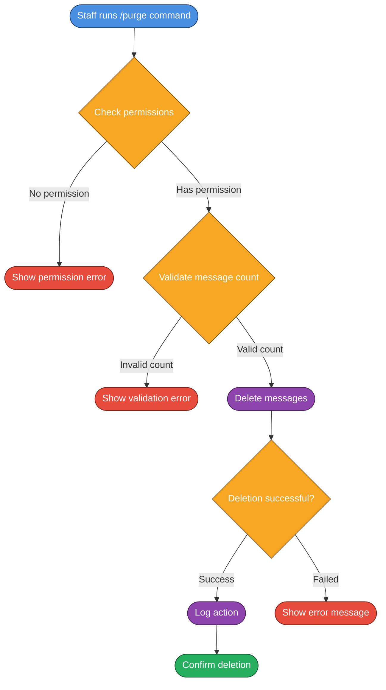

# 🛡️ Moderation System

The **Moderation System** provides essential tools for Discord server moderation, including message management, permission validation, and comprehensive action logging. Designed for efficient server management with role-based access control.

## ✨ Features

### Core Functionality
- **Message Management**: Bulk message deletion with `/purge` command
- **Role-Based Permissions**: Comprehensive permission validation system
- **Staff Commands**: Developer-only commands for bot management
- **Action Logging**: Complete audit trail for all moderation actions
- **Error Handling**: Robust error management and user feedback

### Moderation Tools
- **Bulk Message Deletion**: Remove multiple messages efficiently
- **Permission Validation**: Ensure proper access control
- **Staff Verification**: Developer-only command access
- **Audit Integration**: Integration with Discord audit logs

---

## 🌊 Workflow Overview

### Message Purge Workflow


---

## 🤖 Commands

### Moderation Commands
- `/purge <amount>` - Delete a specified number of messages
  - **Parameters**: 
    - `amount` (required): Number of messages to delete (1-100)
  - **Permissions**: Requires `ManageMessages` permission
  - **Validation**: Ensures amount is within Discord limits
  - **Logging**: All purge actions are logged for audit purposes

### Developer Commands
- `/reload` - Reload bot commands and components (Developer only)
  - **Access**: Restricted to developers listed in config
  - **Functionality**: Hot-reloads bot modules without restart
  - **Safety**: Includes error handling and validation

---

## 📁 Project Structure

### Commands (`src/Commands/Moderation/`)
- **`Purge.js`** - Handles bulk message deletion with validation and logging

### Commands (`src/Commands/Dev/`)
- **`Reload.js`** - Developer-only command for hot-reloading bot modules

### Commands (`src/Commands/Info/`)
- **`Ping.js`** - Bot latency and status information
- **`ServerInfo.js`** - Detailed server information
- **`Userinfo.js`** - User information and statistics

---

## 🔧 Configuration

### Permission Requirements
The moderation system requires specific Discord permissions:

#### Bot Permissions
- `ManageMessages` - Required for message deletion
- `ReadMessageHistory` - Required to access message history
- `SendMessages` - Required to send confirmation messages
- `EmbedLinks` - Required for rich embed responses

#### User Permissions
- `ManageMessages` - Required to use `/purge` command
- Developer role - Required for developer-only commands

### Bot Configuration (`config.js`)
```javascript
// Developer Configuration
developers: [
    {
        name: "Monk",
        id: "1156911026164482078",
    }
],

// Permission Validation
permissionValidation: true,
auditLogging: true,
```

---

## 🛡️ Security & Validation

### Permission System
- **Role-Based Access**: Commands restricted to appropriate roles
- **Permission Validation**: Bot validates user permissions before execution
- **Developer Verification**: Developer commands require specific user IDs
- **Channel Permissions**: Respects Discord's permission hierarchy

### Input Validation
- **Message Count Limits**: Enforces Discord's message deletion limits (1-100)
- **Permission Checking**: Validates user has required permissions
- **Channel Access**: Ensures bot can access and modify the channel
- **Error Handling**: Comprehensive error handling with user-friendly messages

### Safety Features
- **Confirmation Messages**: Users receive confirmation of actions taken
- **Error Recovery**: Graceful handling of API errors and edge cases
- **Audit Trail**: All moderation actions logged for accountability
- **Rate Limiting**: Built-in protection against command spam

---

## 📊 Logging & Audit

### Action Logging
All moderation actions are logged with:
- **User Information**: Who performed the action
- **Action Details**: What action was taken
- **Channel Context**: Where the action occurred
- **Timestamp**: When the action was performed
- **Result**: Success or failure status

### Audit Integration
- **Discord Audit Logs**: Integration with Discord's native audit system
- **Executor Tracking**: Identifies who performed moderation actions
- **Action Context**: Provides context for moderation decisions
- **Compliance**: Maintains records for server administration

---

## 🔧 Technical Features

### Message Management
- **Bulk Deletion**: Efficient deletion of multiple messages
- **API Optimization**: Uses Discord's bulk delete API when possible
- **Error Recovery**: Handles partial deletion failures gracefully
- **Confirmation**: Provides user feedback on deletion results

### Permission Validation
- **Pre-Execution Checks**: Validates permissions before command execution
- **Role Hierarchy**: Respects Discord's role hierarchy
- **Channel Permissions**: Checks channel-specific permissions
- **Bot Permissions**: Ensures bot has necessary permissions

### Error Handling
- **User-Friendly Messages**: Clear error messages for users
- **Developer Logging**: Detailed error logs for developers
- **Graceful Degradation**: System continues working despite errors
- **Recovery Mechanisms**: Automatic recovery from common issues

---

## 📸 Showcase

### Purge Command Usage
```bash
/purge 50
```
**Result**: Deletes 50 messages and provides confirmation with:
- Number of messages deleted
- Channel where deletion occurred
- User who performed the action
- Timestamp of the action

### Permission Error Handling
When users lack permissions:
- Clear error message explaining required permissions
- Suggestion to contact server administrators
- No action taken to prevent unauthorized access

### Developer Commands
Developer-only commands include:
- Additional validation and security checks
- Detailed logging for debugging
- Restricted access to prevent misuse

---

## 🚀 Getting Started

### 1. Configure Permissions
Ensure your bot has the required permissions:
- `ManageMessages` for message deletion
- `ReadMessageHistory` for message access
- `SendMessages` for responses
- `EmbedLinks` for rich responses

### 2. Set Up Developer Access
Add developer user IDs to the configuration:
```javascript
developers: [
    {
        name: "YourName",
        id: "your_discord_user_id",
    }
]
```

### 3. Configure Logging
Set up logging channels for audit trails:
```env
MESSAGE_LOG_CHANNEL_ID=your_message_log_channel_id
WARN_LOG_CHANNEL_ID=your_warning_log_channel_id
```

### 4. Test Commands
Test moderation commands with appropriate permissions:
- `/purge 5` - Test with small number first
- `/ping` - Verify bot responsiveness
- `/serverinfo` - Check server information display

---

## 🔄 Integration with Other Systems

### Logging System Integration
- **Message Events**: All moderation actions logged to message log channel
- **Audit Trail**: Integration with comprehensive logging system
- **Staff Accountability**: Track moderation actions for accountability
- **Compliance**: Maintain records for server administration

### Permission System Integration
- **Role-Based Access**: Integrates with Discord's role system
- **Channel Permissions**: Respects channel-specific permissions
- **Bot Permissions**: Validates bot permissions before operations
- **Hierarchy Respect**: Follows Discord's permission hierarchy

---

## 📊 Analytics & Monitoring

### Moderation Metrics
- **Command Usage**: Track frequency of moderation commands
- **Permission Denials**: Monitor unauthorized access attempts
- **Error Rates**: Track command failure rates
- **Response Times**: Monitor command execution times

### System Health
- **Permission Validation**: Monitor permission check success rates
- **API Response Times**: Track Discord API response times
- **Error Recovery**: Monitor automatic error recovery success
- **Logging Success**: Track audit log creation success

---

## 🔧 Advanced Configuration

### Custom Permission Levels
You can extend the permission system by modifying the base command handler:

```javascript
// Example: Custom permission check
if (!interaction.member.permissions.has(PermissionFlagsBits.ManageMessages)) {
    return interaction.reply({
        content: "❌ You don't have permission to use this command.",
        ephemeral: true
    });
}
```

### Custom Logging
Extend the logging system for additional audit trails:

```javascript
// Example: Custom moderation log
const moderationLog = {
    action: 'purge',
    user: interaction.user.tag,
    channel: interaction.channel.name,
    amount: amount,
    timestamp: new Date()
};
```

---

## 🚨 Troubleshooting

### Common Issues

#### Permission Errors
- **Issue**: Users can't use moderation commands
- **Solution**: Ensure users have `ManageMessages` permission
- **Check**: Verify bot has required permissions

#### API Errors
- **Issue**: Commands fail with Discord API errors
- **Solution**: Check bot permissions and rate limits
- **Check**: Verify Discord API status

#### Logging Issues
- **Issue**: Actions not being logged
- **Solution**: Check logging channel permissions
- **Check**: Verify logging configuration

---

> [!NOTE]
> The moderation system is production-ready with comprehensive error handling, security measures, and audit capabilities. It integrates seamlessly with the bot's logging and permission systems.
