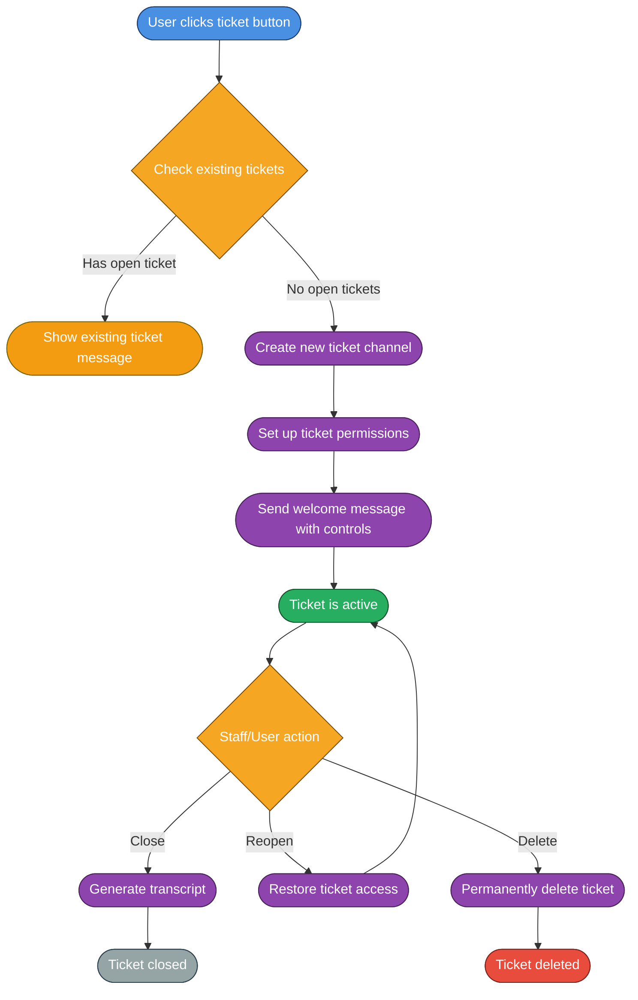

# 🎫 Ticket System

The **Ticket System** provides a comprehensive support and moderation workflow for Discord servers. Users can create different types of tickets for various purposes, and staff can manage them efficiently with automated tools.

## ✨ Features

### Core Functionality
- **Multi-Type Support**: Four different ticket types for various purposes
- **Automated Creation**: Button-based ticket creation with type selection
- **Staff Management**: Complete ticket lifecycle management
- **Transcript System**: Automatic conversation logging and archiving
- **Permission Control**: Role-based access and ownership validation
- **Dashboard Setup**: Easy server setup with `/ticket-setup` command

### Ticket Types
- **🎉 Claim Prize**: For users who have won prizes and need to claim them
- **🎬 Production Inquiry**: For production-related questions or requests
- **ℹ️ General Inquiry**: For general questions or concerns
- **⚖️ Appeal**: For users wishing to appeal team decisions

---

## 🌊 Workflow Overview

### Complete Ticket Lifecycle


---

## 🤖 Commands

### Setup Commands
- `/ticket-setup` - Set up the ticket system dashboard (Admin only)
  - Creates a ticket dashboard with buttons for each ticket type
  - Includes instructions and visual branding
  - Requires administrator permissions

### Ticket Management
Tickets are managed through interactive buttons rather than slash commands:

#### Ticket Creation Buttons
- `ticket-create-claim` - Create a Claim Prize ticket
- `ticket-create-production` - Create a Production Inquiry ticket
- `ticket-create-general` - Create a General Inquiry ticket
- `ticket-create-appeal` - Create an Appeal ticket

#### Ticket Control Buttons
- **Close Ticket** - Closes the ticket and generates a transcript
- **Reopen Ticket** - Reopens a closed ticket
- **Delete Ticket** - Permanently deletes the ticket
- **Transcript** - Generates and sends a transcript of the conversation

---

## 📁 Project Structure

### Commands (`src/Commands/Admin/`)
- **`TicketSetup.js`** - Sets up the ticket dashboard with buttons and instructions

### Components (`src/Components/Buttons/`)
- **`ticket-create.js`** - Handles ticket creation for all types
- **`ticket-close.js`** - Handles ticket closing and transcript generation
- **`ticket-reopen.js`** - Handles ticket reopening
- **`ticket-delete.js`** - Handles permanent ticket deletion
- **`ticket-transcript.js`** - Generates conversation transcripts

### Schemas (`src/Structure/Schemas/Ticket/`)
- **`ticketSchema.js`** - MongoDB schema for ticket data storage

---

## 🔧 Configuration

### Environment Variables
Add these to your `.env` file:

```env
# Ticket System Configuration
TICKET_LOG_CHANNEL_ID=your_ticket_log_channel_id
TICKET_DASH_CHANNEL_ID=your_ticket_dashboard_channel_id
TICKET_SUPPORT_ROLE_ID=your_support_role_id
TICKET_TRANSCRIPT_CHANNEL_ID=your_transcript_channel_id
TICKET_CATEGORY=your_ticket_category_id
```

### Bot Configuration (`config.js`)
```javascript
// Ticket System Settings
ticketSystem: true,
ticketLogChannelId: process.env.TICKET_LOG_CHANNEL_ID,
ticketDashChannelId: process.env.TICKET_DASH_CHANNEL_ID,
ticketSupportRoleId: process.env.TICKET_SUPPORT_ROLE_ID,
ticketTranscriptChannelId: process.env.TICKET_TRANSCRIPT_CHANNEL_ID,
ticketCategoryId: process.env.TICKET_CATEGORY,
```

---

## 📅 Database Structure

### Ticket Schema
```javascript
{
    guildId: String,           // Discord server ID
    userId: String,            // User who created the ticket
    channelId: String,         // Ticket channel ID
    ticketType: String,        // Type of ticket (appeal, claim, general, production)
    isClose: Boolean,          // Whether ticket is closed
    createdAt: Date,          // Ticket creation timestamp
    closedAt: Date,           // Ticket closure timestamp (if closed)
    closedBy: String          // User who closed the ticket (if closed)
}
```

---

## 🛡️ Security & Permissions

### Permission System
- **Ticket Creation**: Any user can create tickets
- **Ticket Management**: Only ticket owner and staff can manage tickets
- **Transcript Access**: Only staff can generate transcripts
- **Ticket Deletion**: Only staff can permanently delete tickets

### Safety Features
- **Duplicate Prevention**: Users can only have one open ticket at a time
- **Channel Validation**: System validates channel existence before operations
- **Permission Checking**: Bot validates permissions before performing actions
- **Audit Logging**: All ticket actions are logged for accountability

---

## 📸 Showcase

### Ticket Dashboard Setup
The `/ticket-setup` command creates a professional dashboard with:
- Visual branding and server information
- Clear instructions for each ticket type
- Interactive buttons for ticket creation
- Professional embed formatting

### Ticket Channel Features
When a ticket is created:
- Dedicated channel with proper permissions
- Welcome message with ticket information
- Control buttons for staff management
- Automatic role and permission assignment

### Transcript System
- **HTML Transcripts**: Professional HTML-formatted conversation logs
- **Automatic Generation**: Transcripts created automatically when tickets close
- **Archival**: Transcripts stored in dedicated channel
- **Searchable Format**: Easy to search and reference

---

## 🔧 Technical Features

### Button-Based Interface
- **Interactive Creation**: Users click buttons to create tickets
- **Type Selection**: Different buttons for different ticket types
- **Staff Controls**: Buttons for close, reopen, delete, and transcript actions
- **Ephemeral Responses**: Private responses for user actions

### Channel Management
- **Automatic Creation**: Ticket channels created automatically
- **Permission Setup**: Proper permissions assigned to ticket channels
- **Category Assignment**: Tickets placed in designated category
- **Cleanup**: Automatic cleanup when tickets are deleted

### Transcript Generation
- **HTML Format**: Professional HTML transcripts with styling
- **Message Preservation**: All messages, embeds, and attachments preserved
- **Timestamps**: Accurate timestamps for all messages
- **User Information**: User details and avatars included

---

## 🚀 Getting Started

### 1. Setup Channels
Create the following channels:
- **Ticket Dashboard**: Where users will see ticket creation buttons
- **Ticket Log**: Where ticket actions are logged
- **Transcript Channel**: Where transcripts are stored
- **Ticket Category**: Category for ticket channels

### 2. Configure Environment
Add the required environment variables to your `.env` file.

### 3. Set Up Dashboard
Run `/ticket-setup` in your ticket dashboard channel to create the interface.

### 4. Assign Roles
Ensure your support role has the necessary permissions to manage tickets.

---

## 🔄 Integration with Other Systems

### Logging Integration
- **Action Logging**: All ticket actions logged to designated channel
- **Audit Trail**: Complete audit trail for moderation purposes
- **Staff Accountability**: Track which staff members perform which actions

### Permission Integration
- **Role-Based Access**: Integrates with Discord's role system
- **Channel Permissions**: Respects Discord's permission hierarchy
- **Bot Permissions**: Validates bot permissions before operations

---

## 📊 Analytics & Monitoring

### Ticket Metrics
- **Creation Rate**: Track how many tickets are created
- **Resolution Time**: Monitor average ticket resolution time
- **Type Distribution**: See which ticket types are most common
- **Staff Performance**: Track staff response times and resolution rates

### System Health
- **Channel Validation**: Monitor ticket channel creation success
- **Permission Issues**: Track permission-related errors
- **Transcript Generation**: Monitor transcript creation success
- **Database Operations**: Track database operation success rates

---

> [!NOTE]
> The ticket system is fully production-ready and includes comprehensive error handling, security measures, and professional UI/UX design.
