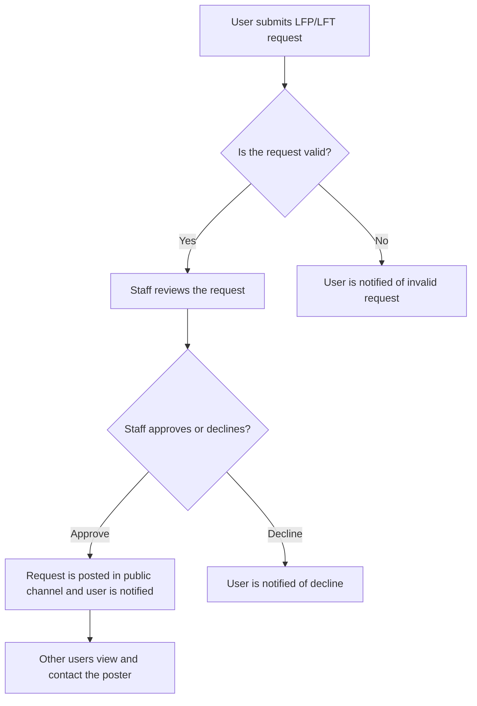
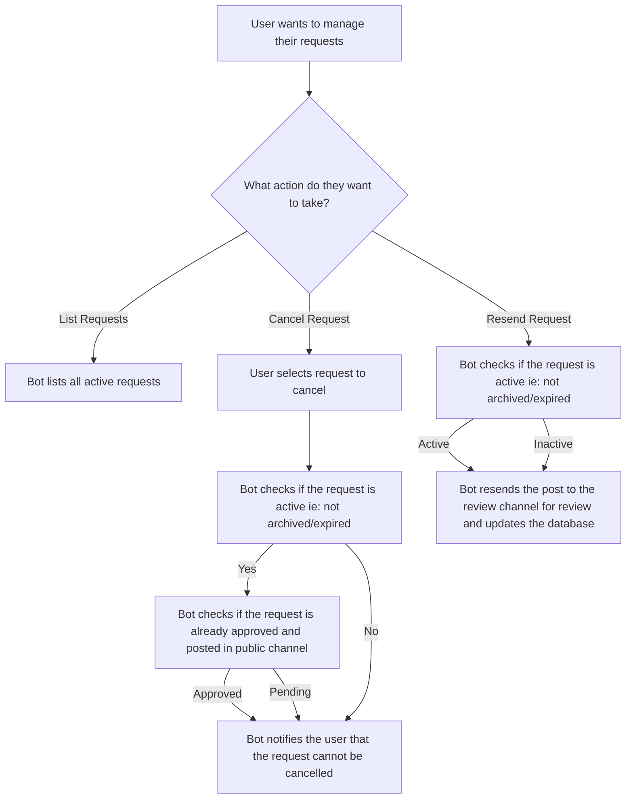

# 🔎 LFP/LFT System

> [!IMPORTANT]
> This page is still work in progress. Do not refer at the moment!

This system allows users to post "Looking For Players" (LFP) or "Looking For Team" (LFT) messages in a designated channel. Other users can then contact the users who posted these messages if they are interested in joining their team or playing together.

---

## 🌊 Flow of functionality

### User posting a request and staff review process


### User managing their requests


---

## 🤖 Commands
- Game specific lfp/lft create commands
    - `valo-looking-for players`
    - `valo-looking-for team`
    - `csgo-looking-for players`
    - `csgo-looking-for team` .... etc (Create commands for other games as per requirement)

- Request management commands
    - `requests list` - List all active LFP/LFT requests
    - `requests cancel <request_id>` - Cancel an active LFP/LFT request
    - `requests resend <request_id>` - Resend an active LFP/LFT request

---

## 📅 Database Structure
```yaml
    userId: { type: String, required: true },
    guildId: { type: String, required: true },
    type: { type: String, enum: ["LFP", "LFT"], required: true },
    game: { type: String,required: true },
    content: { type: Object, required: true }, // Store form details
    status: { type: String, enum: ["pending", "approved", "declined", "archived", "expired"], default: "pending" },
    reviewedBy: { type: String, default: null },
    messageId: { type: String, default: null }, // Review channel message
    publicMessageId: { type: String, default: null }, // Public channel message
    createdAt: { type: Date, default: Date.now }
```

---

## ⚒️ Moderation and Review Process
- Staff members can review pending LFP/LFT requests in a dedicated review channel.
- They can approve or decline requests using buttons.
- Approved requests are automatically posted in a public channel.
- Declined requests notify the user.
- Staff can archive or expire old requests to keep the public channel clean.
- The bot logs all actions for accountability.
- Staff roles and permissions are configurable to control who can review and manage requests.
- The system includes rate limiting to prevent spam and abuse.
- Users can only have a limited number of active requests at a time.

> [!NOTE]
> Ensure to configure the necessary environment variables and database connections as per the main documentation to enable this system.

---

## 📸 Showcase of system

### LFT modal example for Valorant


### Request submission confirmation


### Staff review channel with pending requests


### Public channel with approved requests


### User notification of approved request


### User notification of declined request


### Active requests list command


